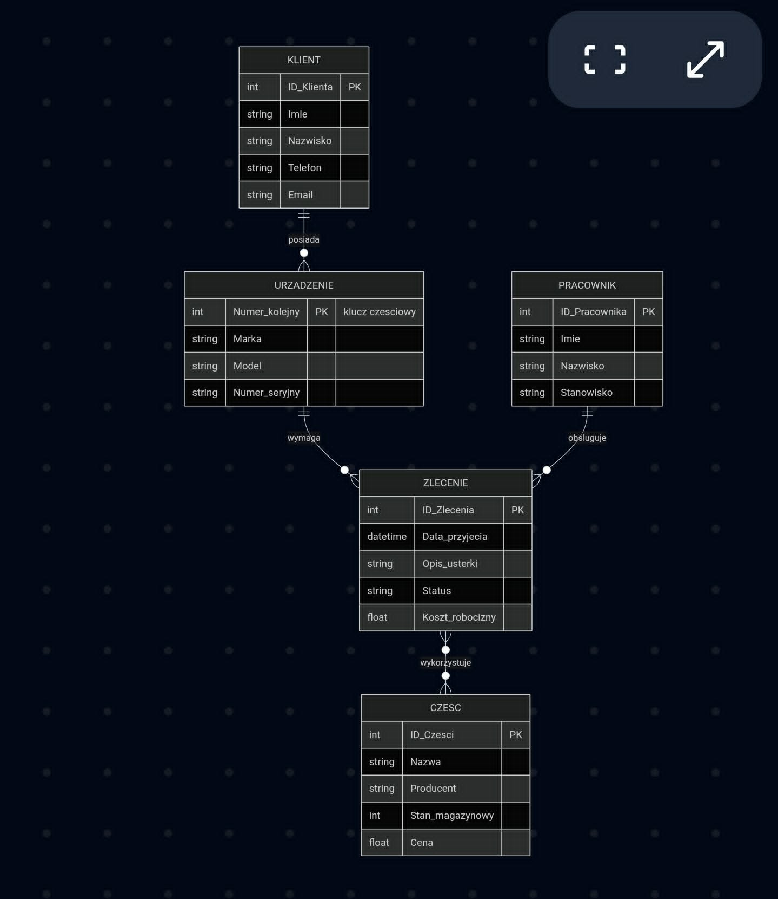
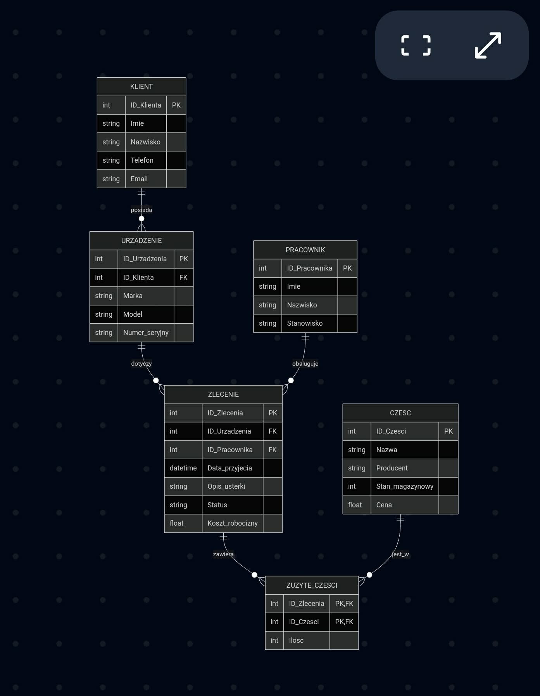

/Author: [Damian Dominiak Michał Bystrzak] / Date: 2026-05-14 / Version: 1.0 /

===============================================
Rozdział 3. Dokumentacja projektowa bazy danych
===============================================

3.1. Wybór zagadnienia i opis procesów
--------------------------------------

Tematem projektu jest relacyjna baza danych dla systemu zarządzania serwisem sprzętu IT. Aplikacja docelowa ma za zadanie obsługiwać pełen cykl życia zlecenia serwisowego – od momentu przyjęcia sprzętu od klienta, poprzez diagnozę i zużycie części magazynowych, aż po ostateczne rozliczenie i wydanie naprawionego urządzenia.

**Główne procesy obsługiwane przez system:**

1. **Ewidencja klientów i urządzeń:** Rejestracja danych kontaktowych klienta oraz powiązanie z nim konkretnych egzemplarzy sprzętu (identyfikowanych m.in. na podstawie numerów seryjnych).
2. **Zarządzanie zleceniami:** Tworzenie nowych zleceń naprawy dla konkretnych urządzeń, przypisywanie do nich techników prowadzących oraz śledzenie statusu prac.
3. **Gospodarka magazynowa części:** Rejestrowanie zużycia części wymiennych w ramach konkretnych zleceń, co pozwala na dokładne wyliczenie kosztów końcowych.

3.2. Prototypy danych i analiza typów
-------------------------------------

W celu weryfikacji kompletności gromadzonych informacji przygotowano prototypowe pliki z jednym wierszem danych dla centralnej encji systemu, jaką jest zlecenie serwisowe.

**Prototyp w formacie JSON:**

.. code-block:: json

    {
      "id_zlecenia": 1024,
      "data_przyjecia": "2024-05-14T12:00:00Z",
      "opis_usterki": "Uszkodzona matryca - pionowe pasy na ekranie",
      "status": "W trakcie diagnozy",
      "koszt_robocizny": 180.50,
      "id_klienta": 45,
      "id_technika": 12
    }

**Prototyp w formacie CSV:**

.. code-block:: text

    id_zlecenia,data_przyjecia,opis_usterki,status,koszt_robocizny,id_klienta,id_technika
    1024,2024-05-14T12:00:00Z,Uszkodzona matryca - pionowe pasy na ekranie,W trakcie diagnozy,180.50,45,12

**Zestawienie typów danych dla wybranych silników:**

.. list-table::
   :widths: 30 35 35
   :header-rows: 1

   * - Atrybut
     - Typ danych (SQLite)
     - Typ danych (PostgreSQL)
   * - ``id_zlecenia``
     - INTEGER PRIMARY KEY
     - SERIAL PRIMARY KEY
   * - ``data_przyjecia``
     - TEXT
     - TIMESTAMP
   * - ``opis_usterki``
     - TEXT
     - TEXT
   * - ``status``
     - TEXT
     - VARCHAR(50)
   * - ``koszt_robocizny``
     - REAL
     - NUMERIC(10, 2)
   * - ``id_klienta``
     - INTEGER
     - INT

3.3. Model koncepcyjny bazy danych
----------------------------------

Na etapie modelowania koncepcyjnego zdefiniowano główne wymagania informacyjne systemu. Zidentyfikowano encje, ich atrybuty oraz relacje zachodzące w analizowanym środowisku. Do wizualizacji wybrano notację Crow's Foot (kurzych łapek) jako współczesny standard branżowy, który zapewnia wyższą czytelność i płynniejsze przejście do modelu logicznego niż tradycyjna notacja Chena.

**Zidentyfikowane encje mocne i ich klucze:**

* **KLIENT:** ``ID_Klienta`` (PK), Imię, Nazwisko, Telefon, Email.
* **PRACOWNIK:** ``ID_Pracownika`` (PK), Imię, Nazwisko, Stanowisko.
* **ZLECENIE:** ``ID_Zlecenia`` (PK), Data_przyjecia, Opis_usterki, Status, Koszt_robocizny.
* **CZĘŚĆ:** ``ID_Czesci`` (PK), Nazwa, Producent, Stan_magazynowy, Cena.

**Zidentyfikowana encja słaba:**

* **URZĄDZENIE:** Posiada klucz częściowy ``Numer_kolejny`` oraz atrybuty Marka, Model, Numer_seryjny. Jest to encja słaba, ponieważ jej egzystencja w systemie jest całkowicie zależna od istnienia powiązanej encji mocnej (KLIENT).

**Związki i krotności:**

W modelu poprawnie zamodelowano ścieżkę powiązań ``KLIENT`` -> ``URZĄDZENIE`` -> ``ZLECENIE``. Uniknięto w ten sposób związku niepoprawnego, zwanego pułapką wiatraka (fan trap), który wystąpiłby, gdyby encje ``URZĄDZENIE`` oraz ``ZLECENIE`` były połączone z encją ``KLIENT`` w sposób niezależny.
W modelu zidentyfikowano również związek wiele-do-wielu (M:N) pomiędzy encjami ``ZLECENIE`` oraz ``CZĘŚĆ``.

   Rys. 1. Diagram koncepcyjny bazy danych serwisu IT.

3.4. Model logiczny i normalizacja
----------------------------------

Model logiczny został opracowany na bazie modelu koncepcyjnego poprzez uszczegółowienie struktury i dostosowanie jej do paradygmatu relacyjnego.

**Eliminacja relacji M:N**

Występująca w modelu koncepcyjnym relacja wiele-do-wielu między zleceniami a częściami została rozwiązana poprzez wprowadzenie tabeli asocjacyjnej (pośredniczącej) o nazwie ``ZUZYTE_CZESCI``. Tabela ta posiada złożony klucz główny (``ID_Zlecenia``, ``ID_Czesci``) oraz dodatkowy atrybut niekluczowy ``Ilosc``. Wprowadzono również klucze sztuczne i obce.

**Proces normalizacji:**

Zaprojektowana struktura została poddana procesowi normalizacji, osiągając **3. postać normalną (3NF)**, co stanowi optymalny kompromis między wydajnością systemu a eliminacją redundancji danych.

* **1NF:** Tabela spełnia pierwszą postać normalną, ponieważ wszystkie atrybuty są atomowe, a dane nadmiarowe (np. wiele użytych części w jednym zleceniu) zostały przeniesione do nowej tabeli.
* **2NF:** Warunek drugiej postaci normalnej jest spełniony. Każdy atrybut niekluczowy jest w pełni funkcyjnie zależny od całego klucza głównego (istotne zwłaszcza w tabeli ``ZUZYTE_CZESCI``, gdzie wartość ``Ilosc`` zależy wprost od pary zlecenie-część).
* **3NF:** Model osiąga trzecią postać normalną, gdyż nie występują w nim żadne zależności przechodnie (tranzytywne) między atrybutami niekluczowymi.

   Rys. 2. Diagram logiczny bazy danych serwisu IT w 3NF.

3.5. Model fizyczny
-------------------

Na podstawie schematu logicznego przygotowano fizyczną implementację struktury danych z uwzględnieniem specyfiki dwóch różnych systemów zarządzania relacyjnymi bazami danych: SQLite oraz PostgreSQL.

3.5.1. Implementacja w środowisku SQLite
^^^^^^^^^^^^^^^^^^^^^^^^^^^^^^^^^^^^^^^^

Model wykorzystuje proste typowanie dostępne w silniku SQLite.

.. code-block:: sql

    CREATE TABLE KLIENT (
        ID_Klienta INTEGER PRIMARY KEY,
        Imie TEXT NOT NULL,
        Nazwisko TEXT NOT NULL,
        Telefon TEXT,
        Email TEXT
    );

    CREATE TABLE URZADZENIE (
        ID_Urzadzenia INTEGER PRIMARY KEY,
        ID_Klienta INTEGER NOT NULL,
        Marka TEXT NOT NULL,
        Model TEXT NOT NULL,
        Numer_seryjny TEXT,
        FOREIGN KEY (ID_Klienta) REFERENCES KLIENT(ID_Klienta)
    );

    CREATE TABLE PRACOWNIK (
        ID_Pracownika INTEGER PRIMARY KEY,
        Imie TEXT NOT NULL,
        Nazwisko TEXT NOT NULL,
        Stanowisko TEXT NOT NULL
    );

    CREATE TABLE ZLECENIE (
        ID_Zlecenia INTEGER PRIMARY KEY,
        ID_Urzadzenia INTEGER NOT NULL,
        ID_Pracownika INTEGER NOT NULL,
        Data_przyjecia TEXT NOT NULL,
        Opis_usterki TEXT NOT NULL,
        Status TEXT NOT NULL,
        Koszt_robocizny REAL,
        FOREIGN KEY (ID_Urzadzenia) REFERENCES URZADZENIE(ID_Urzadzenia),
        FOREIGN KEY (ID_Pracownika) REFERENCES PRACOWNIK(ID_Pracownika)
    );

    CREATE TABLE CZESC (
        ID_Czesci INTEGER PRIMARY KEY,
        Nazwa TEXT NOT NULL,
        Producent TEXT,
        Stan_magazynowy INTEGER DEFAULT 0,
        Cena REAL NOT NULL
    );

    CREATE TABLE ZUZYTE_CZESCI (
        ID_Zlecenia INTEGER,
        ID_Czesci INTEGER,
        Ilosc INTEGER NOT NULL DEFAULT 1,
        PRIMARY KEY (ID_Zlecenia, ID_Czesci),
        FOREIGN KEY (ID_Zlecenia) REFERENCES ZLECENIE(ID_Zlecenia),
        FOREIGN KEY (ID_Czesci) REFERENCES CZESC(ID_Czesci)
    );

3.5.2. Implementacja w środowisku PostgreSQL
^^^^^^^^^^^^^^^^^^^^^^^^^^^^^^^^^^^^^^^^^^^^

Model dostosowany do zaawansowanych możliwości silnika PostgreSQL, wykorzystujący automatyczne generowanie kluczy głównych (typ ``SERIAL``), precyzyjne typowanie numeryczne (``NUMERIC``) oraz rygorystyczne więzy integralności (np. ``CHECK``).

.. code-block:: sql

    CREATE TABLE KLIENT (
        ID_Klienta SERIAL PRIMARY KEY,
        Imie VARCHAR(50) NOT NULL,
        Nazwisko VARCHAR(50) NOT NULL,
        Telefon VARCHAR(15),
        Email VARCHAR(100)
    );

    CREATE TABLE URZADZENIE (
        ID_Urzadzenia SERIAL PRIMARY KEY,
        ID_Klienta INTEGER NOT NULL REFERENCES KLIENT(ID_Klienta),
        Marka VARCHAR(50) NOT NULL,
        Model VARCHAR(50) NOT NULL,
        Numer_seryjny VARCHAR(100) UNIQUE
    );

    CREATE TABLE PRACOWNIK (
        ID_Pracownika SERIAL PRIMARY KEY,
        Imie VARCHAR(50) NOT NULL,
        Nazwisko VARCHAR(50) NOT NULL,
        Stanowisko VARCHAR(50) NOT NULL
    );

    CREATE TABLE ZLECENIE (
        ID_Zlecenia SERIAL PRIMARY KEY,
        ID_Urzadzenia INTEGER NOT NULL REFERENCES URZADZENIE(ID_Urzadzenia),
        ID_Pracownika INTEGER NOT NULL REFERENCES PRACOWNIK(ID_Pracownika),
        Data_przyjecia TIMESTAMP NOT NULL DEFAULT CURRENT_TIMESTAMP,
        Opis_usterki TEXT NOT NULL,
        Status VARCHAR(30) NOT NULL,
        Koszt_robocizny NUMERIC(10, 2)
    );

    CREATE TABLE CZESC (
        ID_Czesci SERIAL PRIMARY KEY,
        Nazwa VARCHAR(100) NOT NULL,
        Producent VARCHAR(50),
        Stan_magazynowy INTEGER DEFAULT 0 CHECK (Stan_magazynowy >= 0),
        Cena NUMERIC(10, 2) NOT NULL CHECK (Cena >= 0)
    );

    CREATE TABLE ZUZYTE_CZESCI (
        ID_Zlecenia INTEGER REFERENCES ZLECENIE(ID_Zlecenia),
        ID_Czesci INTEGER REFERENCES CZESC(ID_Czesci),
        Ilosc INTEGER NOT NULL DEFAULT 1 CHECK (Ilosc > 0),
        PRIMARY KEY (ID_Zlecenia, ID_Czesci)
    );
